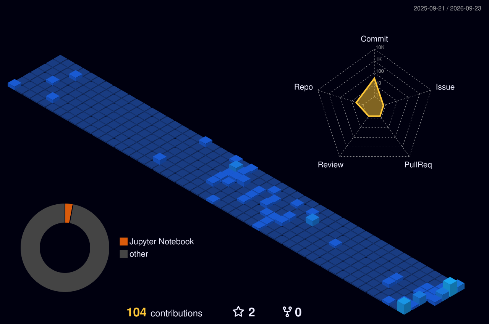

# 👨‍💻 Hi, I'm Kavindu D Herath

**💠Final-Year IT Undergraduate @ University of Moratuwa 💠Founder, Educator, and Aspiring Technologist**

I am a data-driven problem solver and technologist. I specialize in turning complex challenges into scalable, real-world solutions by engineering software applications and exploring advanced fields like AI, Cloud Infrastructure, and Graph Databases. 

🚀 **Currently seeking opportunities to build impactful, data-driven applications leveraging my background in full-stack development and AI.**

---

### 💼 Fast Facts
- 🎓 **Education:** Final-year IT Undergraduate, University of Moratuwa, Sri Lanka.
- 🏢 **Leadership:** Founder & Head of Operations at Mora Pinnacles. I tutor Mathematics, bringing an analytical, real-world problem-solving mindset into the classroom to help students understand the "magic" behind the math.
- 🗣️ **Languages:** English (Fluent) & Sinhala (Native).

---

### 🛠️ Tech Stack & Tools I've Worked With

**Languages:**  
<br>
 Java &nbsp;&nbsp;&nbsp;&nbsp;
 Python &nbsp;&nbsp;&nbsp;&nbsp;
 JavaScript &nbsp;&nbsp;&nbsp;&nbsp;
 PHP &nbsp;&nbsp;&nbsp;&nbsp;
 HTML5 &nbsp;&nbsp;&nbsp;&nbsp;
 CSS3 &nbsp;&nbsp;&nbsp;&nbsp;
 SQL

<br>

**Libraries & Frameworks:**  
<br>
 React &nbsp;&nbsp;&nbsp;&nbsp;
 Node.js &nbsp;&nbsp;&nbsp;&nbsp;
 Tailwind CSS &nbsp;&nbsp;&nbsp;&nbsp;
🗺️ Leaflet

<br>

**Databases & Cloud:**  
<br>
 Neo4j &nbsp;&nbsp;&nbsp;&nbsp;
 PostgreSQL &nbsp;&nbsp;&nbsp;&nbsp;
 Oracle Cloud &nbsp;&nbsp;&nbsp;&nbsp;
✨ Gemini API

<br>

**Tools & IDEs:**  
<br>
 VS Code &nbsp;&nbsp;&nbsp;&nbsp;
 IntelliJ IDEA &nbsp;&nbsp;&nbsp;&nbsp;
🌌 Google Antigravity IDE &nbsp;&nbsp;&nbsp;&nbsp;
 Git &nbsp;&nbsp;&nbsp;&nbsp;
 Jupyter &nbsp;&nbsp;&nbsp;&nbsp;
 Canva &nbsp;&nbsp;&nbsp;&nbsp;
📦 XAMPP &nbsp;&nbsp;&nbsp;&nbsp;
🧪 SoapUI &nbsp;&nbsp;&nbsp;&nbsp;
🚀&nbsp;Apache&nbsp;JMeter

---

### ⏱️ Weekly Coding Activity
<!--START_SECTION:waka-->

```txt
From: 18 September 2026 - To: 25 September 2026

JavaScript   1 hr 29 mins          >>>>>>>>>>>>>>>----------   59.10 %
Python       33 mins               >>>>>>-------------------   22.07 %
Markdown     9 mins                >>-----------------------   06.57 %
Bash         8 mins                >------------------------   05.44 %
Git Config   2 mins                -------------------------   01.91 %
```

<!--END_SECTION:waka-->

---

### 🏆 Key Certifications
- **Oracle Cloud 2025:** Certified AI Foundations Associate & Foundations Associate
- **Neo4j:** Graph Data Modeling, Neo4j, and Cypher Fundamentals
- **HP Life & Sololearn:** Agile Project Management, Data Science & Analytics

---

### 📊 GitHub Stats

<p align="center">
  
</p>

### 🏙️ 3D Contribution Graph
<p align="left">
  
</p>

---

### 📰 Latest Articles by Me ✍️
<!-- BLOG-POST-LIST:START -->
- [Why Data Mining Matters &lpar;And How It Actually Works&rpar;](https://medium.com/@kavindudherath/why-data-mining-matters-and-how-it-actually-works-05b1f913df32?source=rss-a9f8f8be4105------2)
<!-- BLOG-POST-LIST:END -->

---

### ⚡ Recent GitHub Activity
<!--START_SECTION:activity-->
1. 🔒 Closed issue [#1](https://github.com/KavinduDHerath/Programming-Sandbox/issues/1) in [KavinduDHerath/Programming-Sandbox](https://github.com/KavinduDHerath/Programming-Sandbox)
<!--END_SECTION:activity-->

---

### 📫 Let's Connect
Feel free to reach out if you're looking for a developer, have a question, or just want to connect!
- **Email&nbsp;&nbsp;&nbsp;&nbsp;&nbsp;:** kavindudherath@gmail.com
- **LinkedIn:** www.linkedin.com/in/kavindu-d-herath
